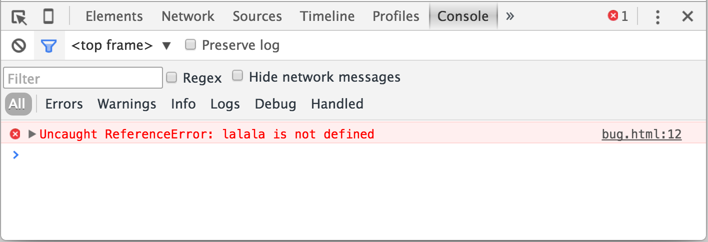

# Consola de desarrollo

Un código es propenso a errores. Es muy probable que tengas errores... Oh de qué estoy hablando? Tu *sin duda alguna* vas a hacer errores, al menos si eres humano y no un [robot](https://en.wikipedia.org/wiki/Bender_(Futurama)).

Pero en el navegador, un usuario no ve los errores por defecto. De manera que, si algo va mal en el script, no veremos qué se rompió y no podremos arreglaron.

Para ver los errores y obtener un montón de otra información Util sobre los script, navegadores tienen embebidos "herramientas de desarrollo".

Mas a menudo los desarrolladores se inclina hacia Chrome o Firefox para el desarrollo, porque las herramientas de desarrollo son mejores ahí. Otros navegadores proveen herramientas de desarrollo, algunas veces con características especiales, pero usualmente esta en un "proceso de alcanzarlo". Así que la mayoría de personas tiene un navegador "favorito"y cambian a otros si un problema es específico del navegador. 

Las herramientas de desarrollador son muy poderosas, existe muchas caracterísiticas. Aquí, para comenzar, aprenderemos como abrirlos, buscar en los errores y correr comandos de JavaScript. 

[cut]

## Google Chrome

Abre la página [bug.html](bug.html).

Hay un error en el código de JavaScript en él. Esta oculto para los ojos de los visitantes regulares del sitio. Así que abramos las herramientas de desarrollador para verlo. 

Presiona la tecla `tecla:F12` o, si estas en Mac, entonces `teclas:Cmd+Opt+J`

Las herramientas de desarrollador abriran en el tab Consola por defecto. 

Se ve un poco como sigue: 

La vista exacta depende de tu versión de Chrome. La vista cambia de tiempo en tiempo pero debe ser simial.

- Aquí podemos ver un mensaje de error en color rojo. En este caso el script contiene un desconocido comando "lalala".
- A la derecha, hay un link clickeable a la fuente de `bug.html:12` con el número de línea donde ocurre el error. 

Debajo del mensaje de error hay un símbolo `>` azul. Marca una "línea de comando"donde podemos escribir comandos de JavaScript y presionar `key:Enter` para correrlos (`key:Shift+Enter` para ingresar múltiples líneas).

Ahora podemos ver errores y eso es suficiente para comenzar. Regresaremos a las herramientas de desarrollo luego y cubriremos el proceso de debugging a profundidad en el capítulo <info:debugging-chrome>.

## Firefox, Edge y otros

La mayoría de otros navegadores usa la tecla `key:F12` para abrir las herramientas de desarrollo. 

Cómo se ven es bastante similar. Una vez conoces cómo usar uno de ellos (puedes empezar con Chrome), puedes fácilmente cambiar a otro. 

## Safari

Safari (Navegador de Mac, no soportado por Windows/Linux) es un poco especial aquí. Necesitamos habilitar el menú de desarrollo o "Develop menu" primero.

Abre Preferencias y ve a panle de "Avanzados". Hay un checkbox en la parte baja del panel: 

Ahora `key:Cmd+Opt+C` puede habilitar/deshabilitar la consola. También notar ha aparecido un nuevo menú llamado "Develop". Tiene varios comandos y opciones. 

## Resumen

- Las herramientas de desarrollo nos permiten ver errores, correr comandos, examinar variables y mucho más. 
- Se pueden abrir con la tecla `key:F12` en la mayoría de navegadores en Windows. Chrome para Mac necesita `key:Cmd+Opt+J`, Safari: `key:Cmd+Opt+C` (necesitas habilitarlo primero).

Ahora tenemos el ambiente listo. En la siguiente sección veremos más de JavaScript. 